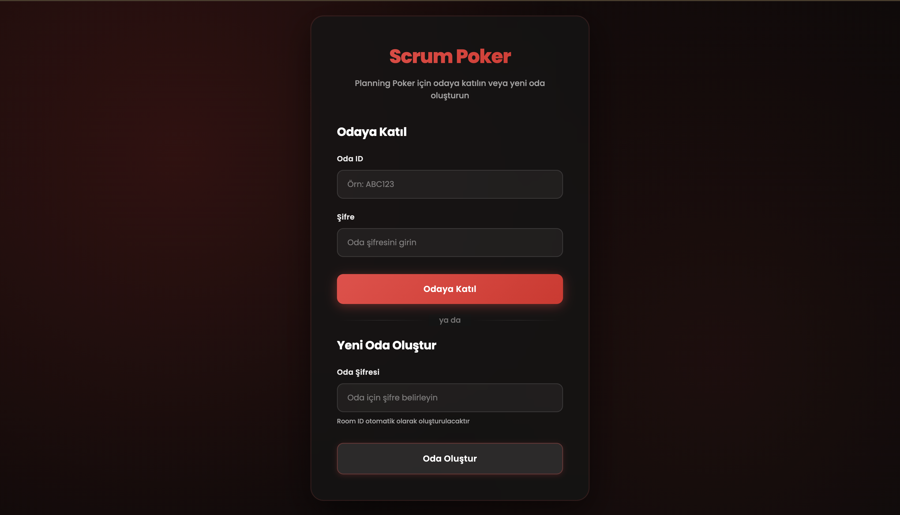
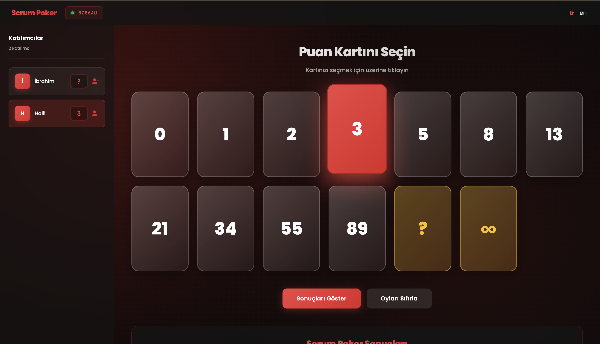
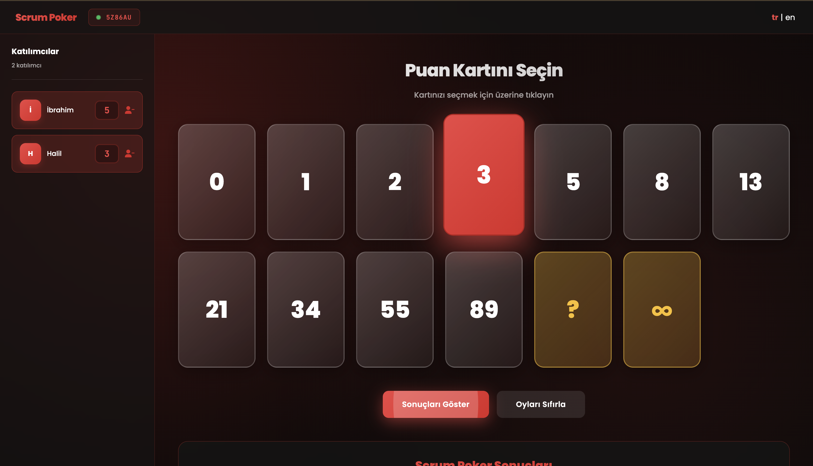
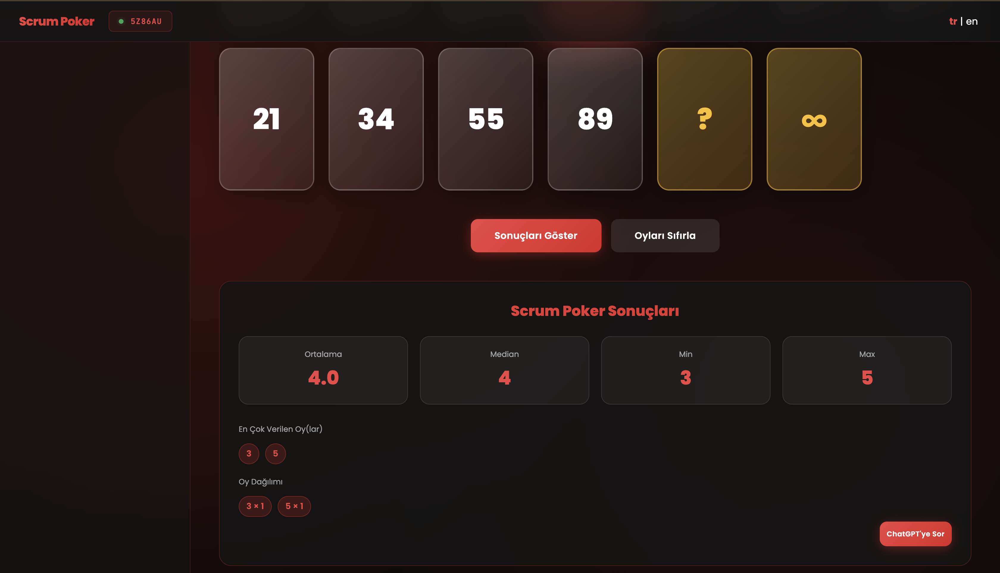

# Scrum Poker

Scrum Poker is a web application that allows teams to quickly and visually estimate tasks. Built with Django, Redis, and Channels, it is production-ready and containerized with Docker.

## Table of Contents

- [Author](#author)
- [Project Dependencies](#project-dependencies)
- [Project Overview](#project-overview)
- [Installation](#installation)
- [Running the Project](#running-the-project)
- [App Images](#app-images)
- [License](#license)

## Author

**Halil İbrahim ŞENAYDIN**  
E-mail: halilsenaydin@gmail.com  
GitHub: [github.com/halilsenaydin](https://github.com/halilsenaydin)

## Project Dependencies

Ensure you have the following software installed on your machine:

- [Docker and Docker Engine](https://www.docker.com/)

## Project Overview

### Key Capabilities

- Real-time game rooms
- Card-based task estimation system
- Django Channels with Redis and WebSocket support
- Production-ready Docker and Nginx configuration

### Technologies Used

- Django
- Firebase
- Redis
- WebSockets
- Docker
- Nginx

## Installation

### Clone the repository:

Clone the project from GitHub:

```bash
git clone https://github.com/halilsenaydin/scrum-poker.git
cd scrum-poker
```

### Set up environment variables (`.env` file):

```env
SECRET_KEY=your_secret_key
DEBUG=False
APP_HOST=scrumpoker.com.tr,www.scrumpoker.com.tr
REDIS_HOST=redis
REDIS_PORT=6379
```

## Running the Project

### Running the Django Server:

```bash
# For prod env
docker compose -f docker-compose.prod.yml up

# For dev env
docker compose -f docker-compose.dev.yml up
```

The project can be viewed at `localhost:8000`

## App Images

### Home



### Room







## License

This project is licensed under the MIT License.

You are free to use, modify, and distribute this code for both personal and commercial purposes.

See the [LICENSE](./LICENSE) file for full license text.
